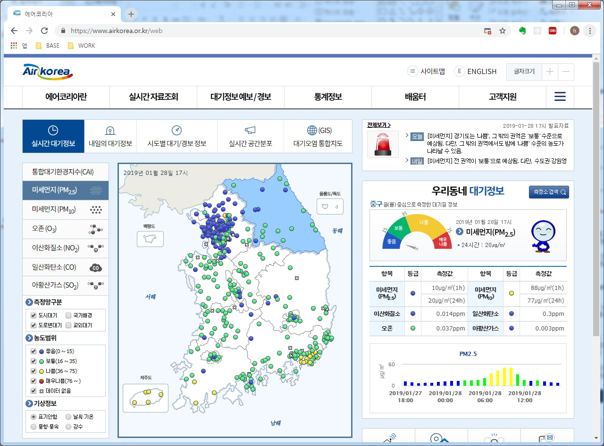

MFPlayer 는 한국환경공단(https://www.airkorea.or.kr)에서 제공하는 미세먼지 데이터를 이용하여 미디어 파사드를 통해 표출합니다.

미세먼지 시각화(Visualizer)에는 **그래프**, **글자 표시**, **색상표** 등의 다양한 방법이 있습니다. 아래 그림은 미세먼지 시각화의 한 예입니다. 엔토스는 사용자의 미디어 파사드 설치환경에 맞는 최적화된 미세먼지 시각화 방법을 제공합니다.

