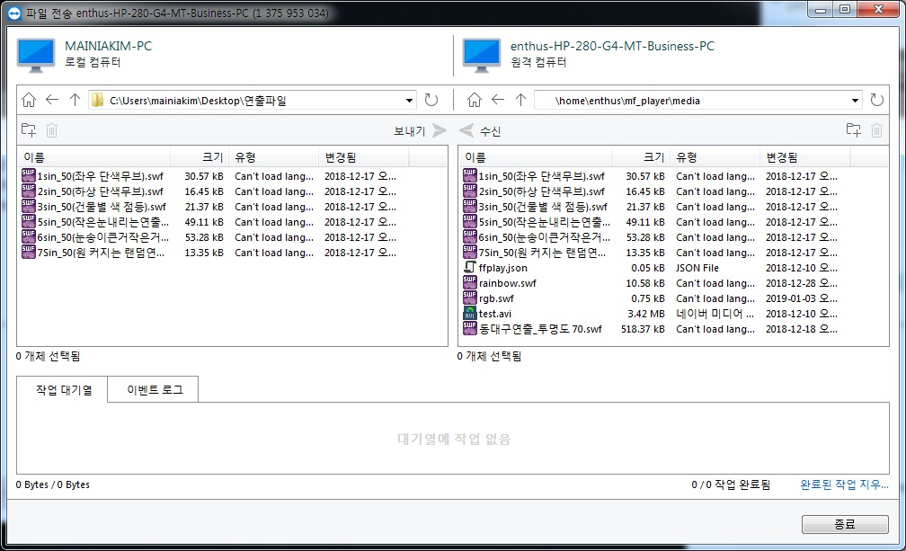

# TeamViewer 를 이용한 원격제어
TeamViewer 는 원격 컴퓨터 제어 프로그램으로 비상업적 목적일 경우 무료 라이선스로 사용할 수 있습니다. 영리 목적 사용을 위한 라이선스 구매는 [www.teamviewer.com](www.teamviewer.com) 홈페이지를 통해 가능합니다.

!!! note
    아래에 설명된 TeamViewer 설치 및 사용방법에 어려움이 있을 경우 언제든지 [엔토스](www.etslight.co.kr)에 문의하여 기술 지원을 받으시기 바랍니다.

### 다운로드 및 설치
[www.teamviewer.com](www.teamviewer.com) 에 접속하여 다운로드 버튼을 누르고 사용하는 운영체제에 맞는 설치 파일을 받아 실행합니다.

기본 설정 이외에 자세한 내용은 [www.teamviewer.com](www.teamviewer.com) 을 참조하십시요.

### 원격 접속
설치가 완료되면 TeamViewer 를 실행하고 엔토스 담당자에게 받은 ID 와 password 를 입력하여 MFPlayer 에 접속합니다.

접속이 정상적으로 완료되면 아래와 같이 MFPlayer 제어화면이 나타납니다.

### 미디어 파일 전송
파일 전송 버튼을 눌르면 전송창이 나타납니다.

전송창의 왼쪽 부분은 내컴퓨터, 오른쪽은 MFPlayer 서버의 폴더입니다.

내컴퓨터에서 전송할 파일을 선택합니다.

오른쪽 부분에서 `/home/enthus/mf_player/media` 폴더를 선택합니다.

화살표 모양의 전송버튼을 누르면 왼쪽 아래 부분에 전송 상태가 표시되면서 진행이 되기 시작합니다.

### 전송 파일 확인
스케쥴 편집의 미디어 선택 버튼을 누르면 전송이 완료된 파일들이 리스트로 표시됩니다. 미디어 파일을 선택하여 사용하는 방법은 이어지는 [스케쥴 추가 / 편집](/mfplayer/index) 문서에서 확인하시기 바랍니다.