**VNC(Virtual Network Computing) 를 이용한 원격제어**

VNC(Virtual Network Computing, 가상 네트워크 컴퓨팅)는 컴퓨터 환경에서 RFB 프로토콜을 이용하여 원격으로 다른 컴퓨터를 제어하는 그래픽 데스크톱 공유 시스템입니다.
자판과 마우스 이벤트를 한 컴퓨터에서 다른 컴퓨터로 전송시켜서 네트워크를 거쳐 그래픽 화면을 갱신하는 방식을 제공합니다.

공개된 표준 프로토콜이기 때문에 로컬 환경에서 라이센스 문제없이 무료로 사용이 가능한 툴이 다양하게 있습니다.

대표적으로 RealVNC 의 VNC Viewer 와 tightVNC, Chrome 에서 사용가능한 VNC 확장기능, Ubuntu 의 vino 등의 툴이 있습니다.

가장 많이 사용되는 툴인 RealVNC 의 VNC Viewer 를 사용하여 MFPlayer 를 제어하는 방법을 설명드리겠습니다.

!!! note
    아래에 설명된 VNC Viewer 설치 및 사용방법에 어려움이 있을 경우 언제든지 [엔토스](http://www.etslight.co.kr)에 문의하여 기술 지원을 받으시기 바랍니다.

**다운로드 및 설치**

[RealVNC VNC Viewer](https://www.realvnc.com/en/connect/download/viewer/) 에 접속하여 다운로드 버튼을 누르고 사용하는 운영체제에 맞는 설치 파일을 받아 실행합니다.

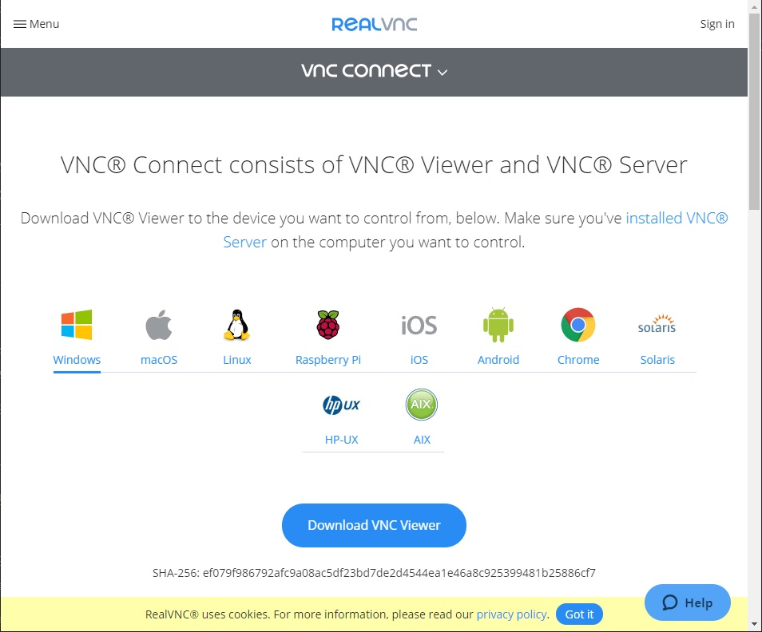

**원격 접속**

설치가 완료되면 VNC Viewer 를 실행하고 엔토스 담당자에게 받은 IP Address 와 ID 및 password 를 입력하여 MFPlayer 에 접속합니다.

접속이 정상적으로 완료되면 아래와 같이 MFPlayer 제어화면이 나타납니다.

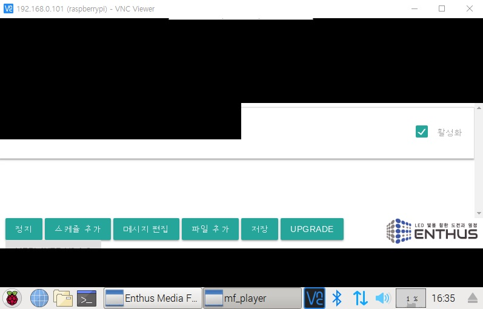

**미디어 파일 전송**

제어 화면의 중앙 상단에 VNC 제어 메뉴판이 숨겨져 있는 것을 확인 할 수 있습니다.

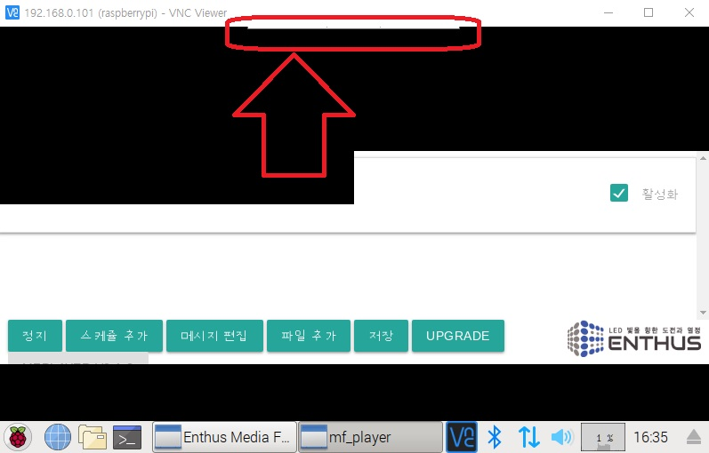

마우스를 숨겨져 있는 메뉴판 근처로 가져가면 파일 전송을 위한 메뉴판이 나타납니다.

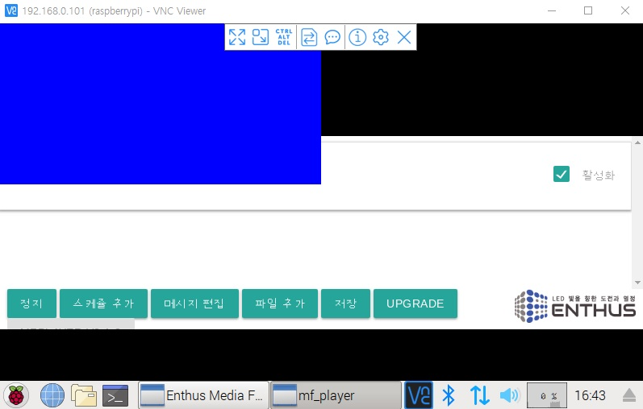

메뉴판에서 파일 전송 아이콘을 선택합니다.

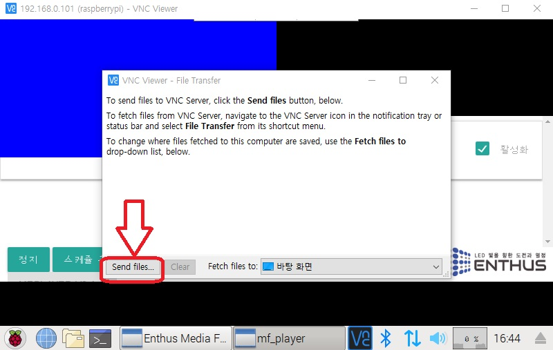

파일 전송을 위한 윈도우가 나타납니다.

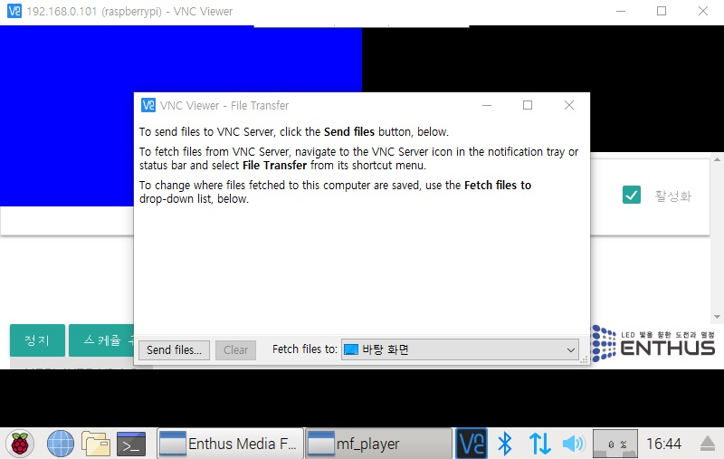

파일 전송 윈도우에서 파일 선택 버튼을 클릭합니다.

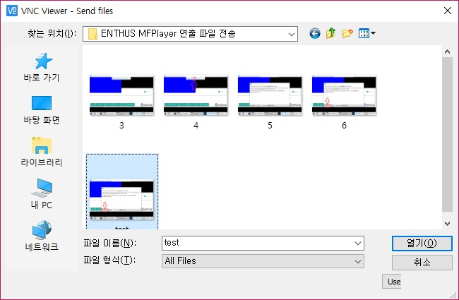

내컴퓨터에서 전송할 파일을 선택합니다.

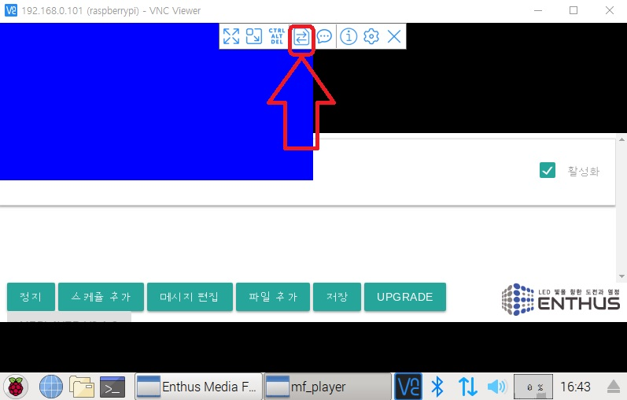

전송이 완료된 화면은 아래와 같습니다.

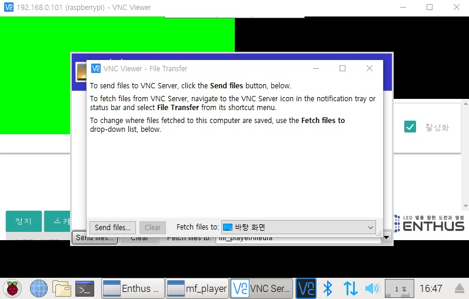

파일 전송 윈도우를 닫습니다. 하지만 MFPlayer 원격 창에 열려있는 파일 전송 윈도우도 같이 닫아야 합니다.

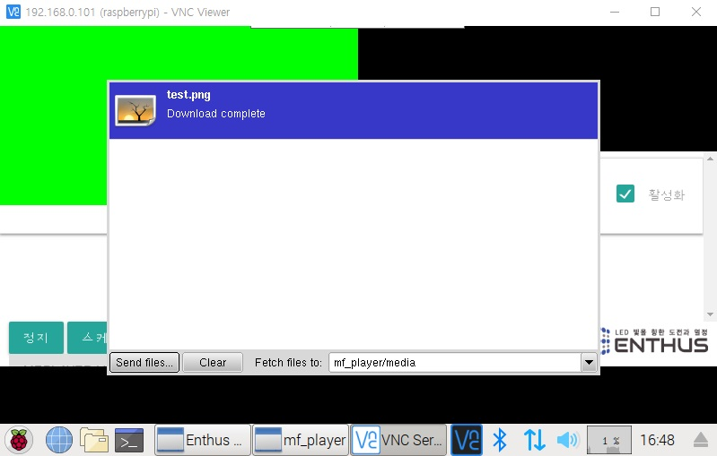

MFPlayer 의 아래쪽에 파일 전송 윈도우의 상태창을 오른쪽 클릭하면 윈도우를 닫을 수 있는 메뉴가 나타납니다.
창닫기를 선택해 파일 전송 윈도우를 닫아 파일 전송을 완료합니다.

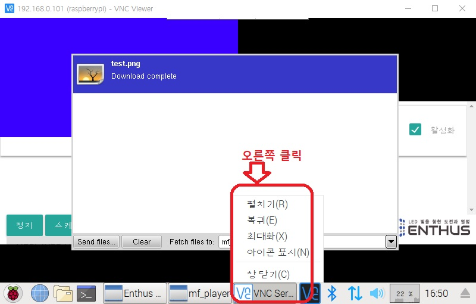

**전송 파일 확인**

스케쥴 편집의 미디어 선택 버튼을 누르면 전송이 완료된 파일들이 리스트로 표시됩니다. 미디어 파일을 선택하여 사용하는 방법은 이어지는 [스케쥴 추가 / 편집](/mfplayer/index) 문서에서 확인하시기 바랍니다.

**시간 설정**

MFPlayer 에는 NTP(Network Time Protocol) 를 이용한 자동 시간 설정 기능이 있습니다. 하지만 인터넷망에 연결되지 못할 경우 명령창을 이용하여 시간을 설정해야 합니다.

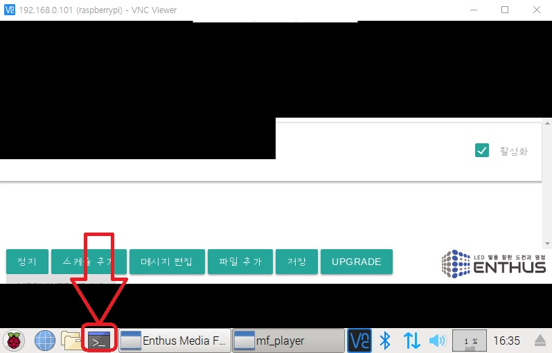
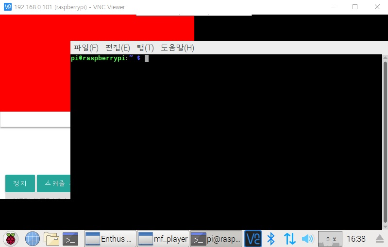
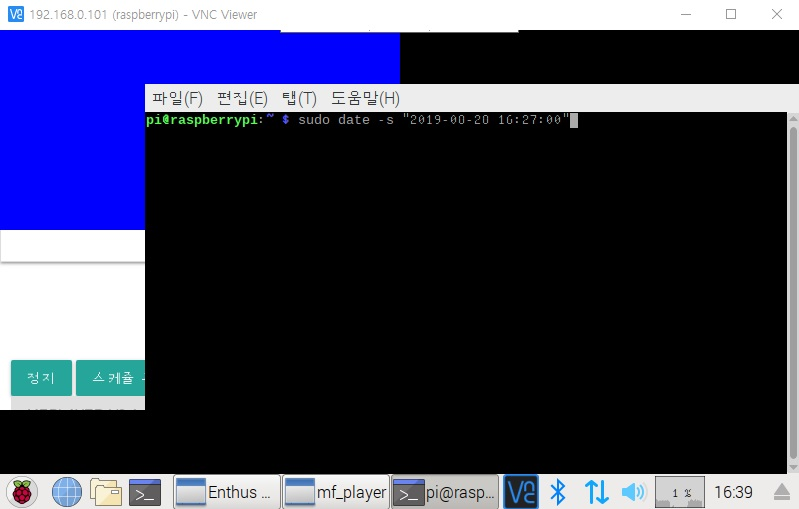
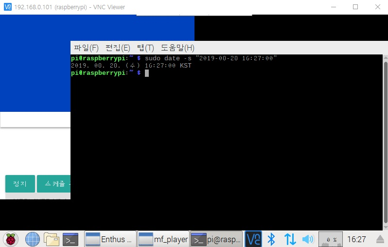
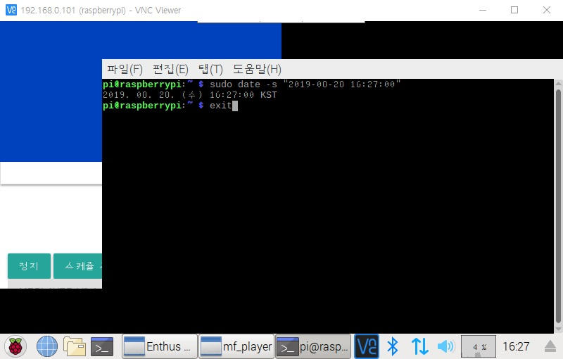
