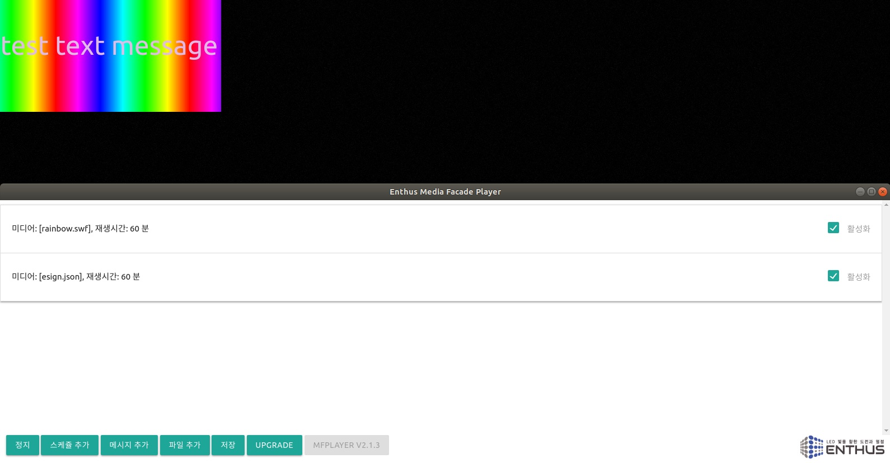
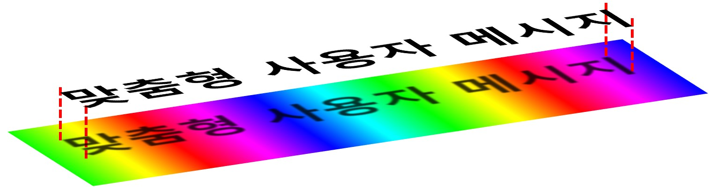
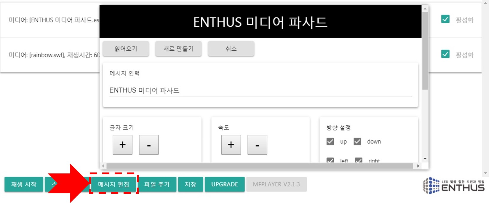
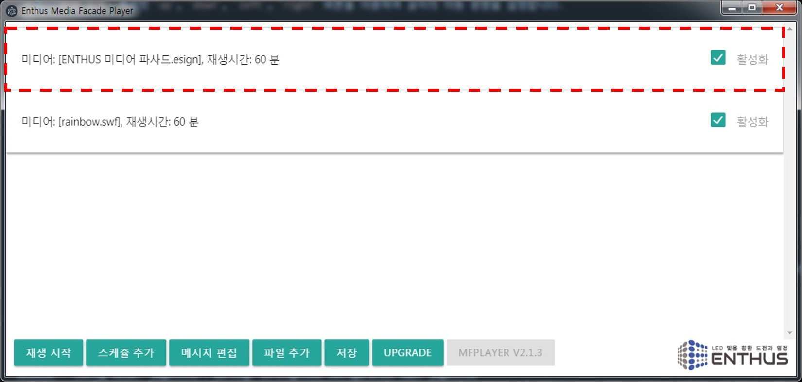
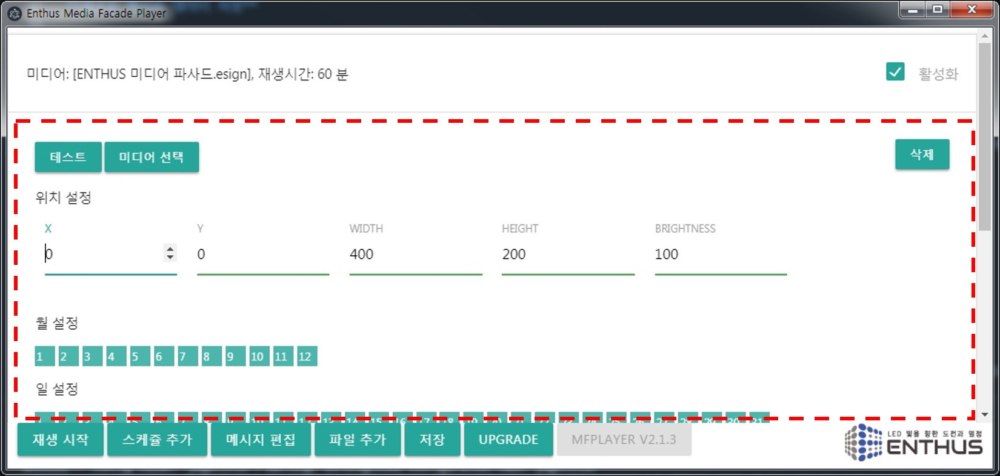
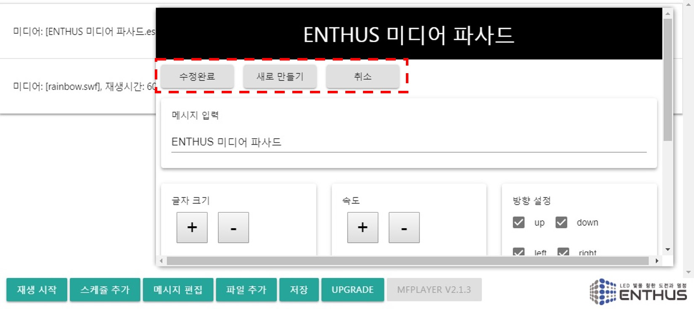

MFPlayer 메시지 편집기를 이용하여 사용자 맞춤형 메시지를 연출합니다.

MFPlayer 메시지 편집기는 표출 메시지와 이동 방향, 움직임 속도, 글자 색, 글자 크기를 설정할 수 있습니다.

입력된 메시지 연출은 같은 시간에 연출되는 영상 파일 위에서 재생됩니다.
즉, 아래 그림과 같이 2개의 연출 Layer 형태로 글자는 Top layer, 영상은 Bottom layer 에 위치하게 됩니다.

각각 분리된 메시지, 영상 설정 기능으로 다양한 스케쥴 시간 설정을 사용하면 더 많은 배경 형태의 메시지 연출을 사용할 수 있습니다.

메시지는 아래의 과정을 거쳐 MFPlayer 에 추가됩니다.

* 메시지 편집기를 이용한 연출 설정
* 새로운 메시지 데이터 저장
* 크기, 위치, 스케쥴 정보를 입력
* 완료 후 재생

**메시지 편집기를 이용한 연출 설정**

하단의 `메시지 편집` 버튼을 누르면 메시지 편집기 창이 열립니다.

`메시지 입력` 란에 글자를 입력합니다. 미디어 파사드의 설치 환경에 따라 표시할 수 있는 글자의 수가 제한됩니다.

!!! warning
    `글자 크기` 설정과 `메시지 입력` 의 글자수가 설치된 미디어 파사드의 표출 가능 크기를 초과되지 않도록 주의하셔야 합니다. 일반적으로 미디어 파사드 표출 화면은 MFPlayer 제어창의 화면 사이즈보다 작습니다.

`글자 크기` 섹션의 `+`, `-` 버튼을 누르면 글자의 크기가 확대/축소됩니다.

`속도` 섹션의 `+`, `-` 버튼으로 글자의 이동 속도를 조절합니다. `+` 버튼은 속도를 빠르게, `-` 버튼은 속도를 느리게 합니다.

`방향 설정` 섹션의 `up`, `down`, `left`, `right` 버튼을 이용하여 글자의 이동 방향을 설정합니다.

`up` 버튼을 누르면 글자가 아래에서 나타나 중간에 멈추었다가 다시 위로 움직이며 사라지는 연출을 합니다.

`down`, `left`, `right` 버튼도 같은 방식으로 위에서 아래로, 오른쪽에서 왼쪽으로, 왼쪽에서 오른쪽으로 움직이는 연출을 의미합니다.

!!! note
    두개 이상 선택 할 경우 선택한 순서에 따라 이동 방향이 달라집니다.
    예를 들어 `up`, `left` 를 선택하면 글자가 아래에서 나타나 위로 이동하고, 이어서 오른쪽에서 나타나 왼쪽으로 이동하는 동작을 합니다.
    정상동작을 위해서는 반드시 한개 이상의 방향을 선택해야 합니다.

`취소` 버튼을 누르면 저장없이 편집기가 닫힙니다. 설정값이 복구되지 않으니 주의해서 사용하시기 바랍니다.

**새로운 메시지 데이터 저장**

`새로 만들기` 버튼을 누르면 메시지 편집기 창이 닫히면서 새로운 메시지 스케쥴이 생성됩니다.
스케쥴 선택 창에 새로운 스케쥴이 추가된 것을 확인 할 수 있습니다.

!!! note
    새로운 메시지 파일의 이름은 입력된 글자로 자동 설정됩니다. 예를 들어 **ENTHUS 미디어 파사드** 로 글자를 입력하면 **ENTHUS 미디어 파사드.esign** 으로 새로운 메시지 파일이 생성됩니다. 같은 이름의 파일이 이미 존재하고 있다면 뒤에 번호가 순서대로 추가됩니다.

**크기, 위치, 스케쥴 시간 설정**

새로 추가된 메시지 스케쥴의 모든 옵션은 기본 값으로 설정되어 있기 때문에, 설치된 미디어 파사드 환경에 맞는 변경이 필요합니다.
[스케쥴 섹션](/mfplayer/position)을 참조해서 연출 의도에 맞는 설정으로 바꾸십시요.

**기존 메시지 데이터 수정**

`읽어오기` 버튼으로 기존에 만들었던 메시지 데이터 파일을 불러올 수 있습니다. 수정 후에는 다시 `수정완료` 버튼을 눌러 수정내역을 저장합니다.

`새로 만들기` 버튼을 누르면 새로운 메시지 데이터 파일과 새로운 스케쥴이 생성됩니다.
마찬가지로 새로 생성된 스케쥴 데이터의 모든 옵션은 기본 값으로 설정되어 있기 때문에 변경이 필요합니다. 하지만 같은 이름으로 저장할 경우 기존 스케쥴 데이터의 옵션이 초기화 되지는 않습니다.

!!! warning
    `수정완료` 로 저장할 경우 메시지 파일의 이름이 변경되지 않습니다. 처음 메시지 파일을 만들었을때 생성된 메시지 파일명이 그대로 유지되니 주의하시기 바랍니다.

**완료 후 재생**

`재생` 버튼을 누르면 새로운 스케쥴이 저장되면서 MFPlayer 의 스케쥴 연출이 시작됩니다.

**웹 편집기**

[엔토스 웹 메시지 편집기](https://enthusapp.github.io/esign) 에서도 메시지 편집이 가능합니다.

메시지 편집기와 동일한 방법으로 원하는 글자를 설정한뒤, 완료 버튼을 누르면 메시지 데이터 파일이 다운로드 폴더에 생성됩니다.

생성된 파일을 USB 메모리에 복사하고 [파일추가](/mfplayer/file_add) 방법을 이용하여 MFPlayer 에 전달/설정합니다. 자세한 내용은 [파일추가](/mfplayer/file_add) 섹션을 참조하시기 바랍니다.