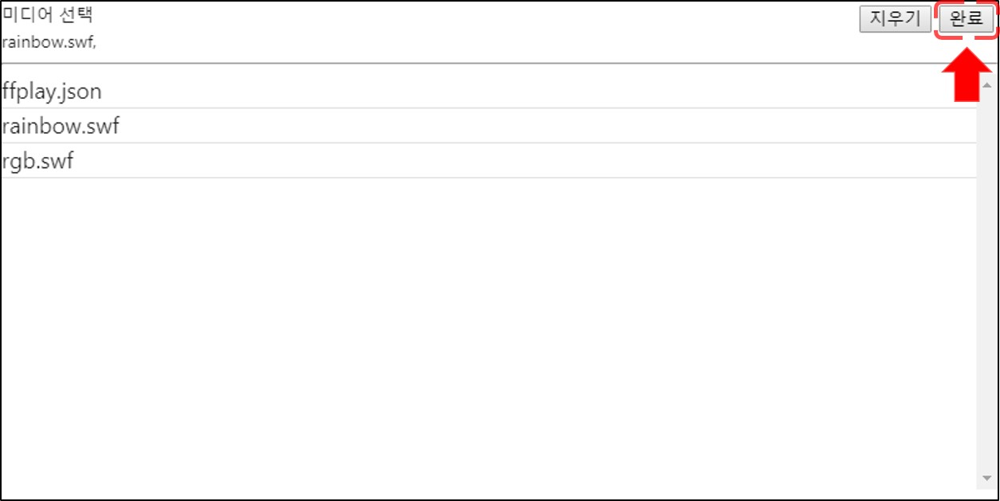
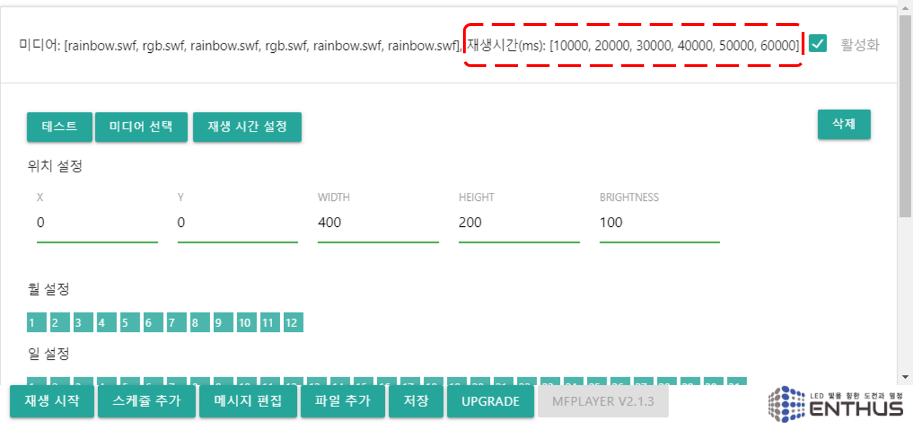

**Group Play**

MFPlayer 에는 여러개의 미디어 파일을 같은 설정으로 재생할 수 있는 Group Play 기능이 있습니다. 원하는 미디어 파일을 선택하면 차례대로 상단의 선택 리스트에 미디어 파일명이 표시됩니다.

오른쪽 상단 완료버튼을 눌러 선택을 종료합니다.

선택을 취소하려면 다시 `미디어 선택` 버튼을 누르고 상단 오른쪽의 `지우기` 버튼을 눌러 차례로 삭제합니다.

스케쥴 제목에 선택된 파일 리스트가 표시되고, 각 미디어의 재생 시간이 표시됩니다.

미디어의 재생 시간을 수정하기 위해 `재생 시간 설정` 버튼을 클릭합니다.

각 미디어의 재생 시간을 수정 후 완료 버튼을 누릅니다. 재생 시간은 ms 단위로 설정됩니다. 최소 동작 시간은 500 ms 이고, 100 ms 단위로 변경할 수 있습니다.

