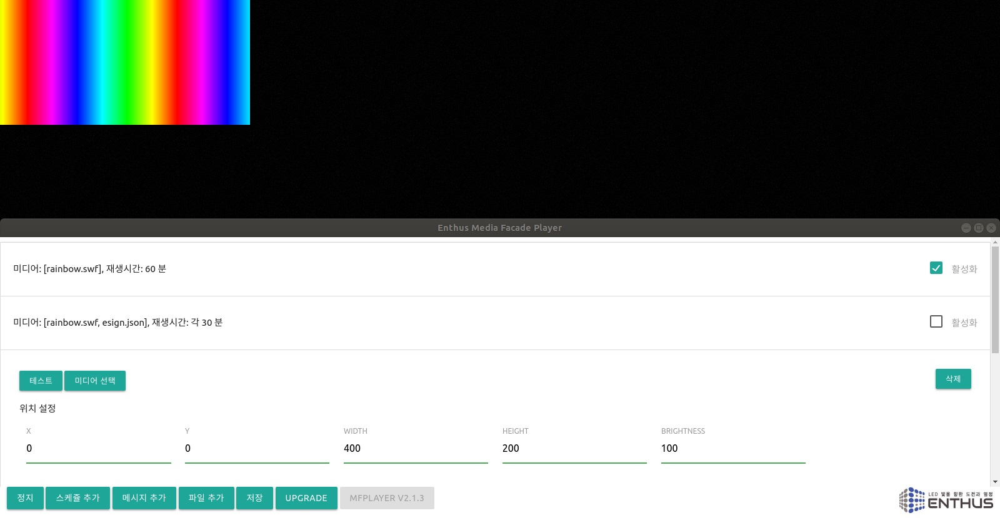
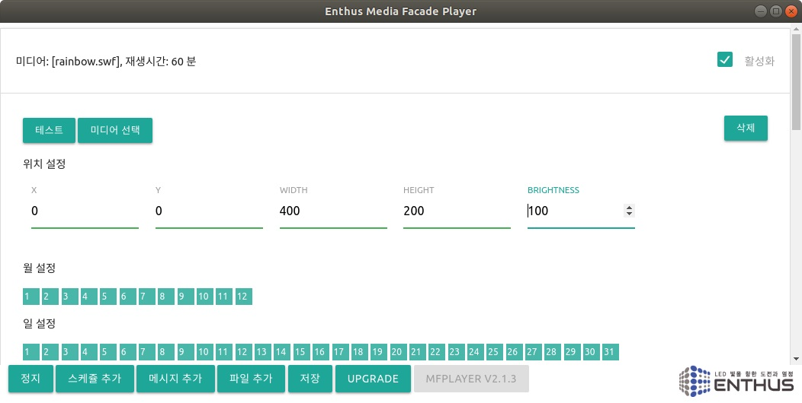

**MFPlayer** 는 (주)엔토스의 지능형 미디어 파사드 연출 장치로, **재생시간**과 다양한 **연출 방식**을 설정하여 사용자의 요구와 설치 환경에 최적화된 경관 조명 제어 시스템을 제공합니다.

또한 **장치간 동기화** 및 **프로그램 Upgrade** 등의 추가 기능을 통해 넓은 지역의 연출 동기화 및 원격 유지 보수 시스템 구축이 가능합니다.

MFPlayer 의 제어 화면은 `연출 화면` 과 `제어 창` 으로 나누어져 있습니다.

`연출 화면` 은 미디어 파사드에 실제 보여지는 공간으로 MFPlayer 하드웨어를 통해 각 조명에 전달됩니다. 설치 환경에 따라 다르지만 일반적으로 왼쪽 상단에 위치합니다.

`제어 창` 에서는 MFPlayer 의 동작을 제어합니다. 연출의 시작과 정지, 스케쥴 설정, 새로운 연출 추가, 프로그램 Upgrade 등의 동작을 제어합니다.

**재생 시간 스케쥴 시스템**

MFPlayer 는 정해진 시간에 맞춰 주기적으로 영상을 재생합니다. 따라서 모든 연출이 스케쥴 설정에 따라 동작됩니다. 필요한 주요 설정은 아래와 같습니다.

* **시간**: 주기적인 재생 타이밍 설정
* **위치 / 크기**: 연출화면의 위치, 시스템 구축과정에서 정의
* **연출 파일**: 영상 파일 또는 사용자 연출 데이터

**맞춤형 사용자 연출**

MFPlayer 는 기본적으로 flash 로 제작된 swf 영상 파일을 사용하지만, [메시지 편집기](/mfplayer/esign) 와 [미세먼지 Visualizer](/mfplayer/air_pollution) 를 이용하여 사용자 맞춤형 글자 및 미세먼지 시각화 연출이 가능합니다.

**장치간 동기화**

MFPlayer 는 유/무선 LAN 연결을 이용하여 광대역 연출 동기화 시스템을 구축할 수 있습니다.

**프로그램 Upgrade**

MFPlayer 는 인터넷을 통한 원격 업그레이드를 지원합니다. 인터넷 설치가 어려운 환경에서는 스마트폰 테더링을 통한 일시적인 네트워크 연결로 원격 업그레이드가 가능합니다.

원격 업그레이드를 통해 미디어 파사드 시스템 설치 완료 후에도 지속적인 기능 업그레이드를 지원 받으시기 바랍니다.