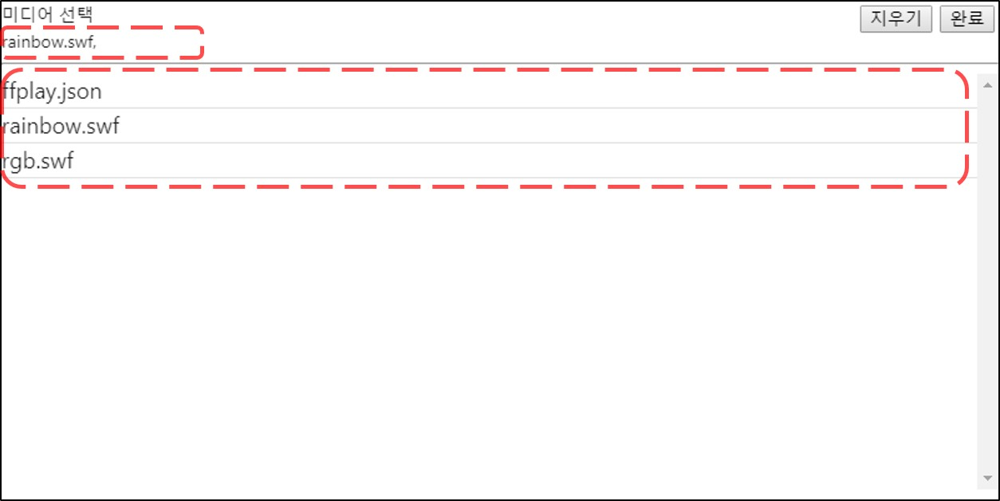
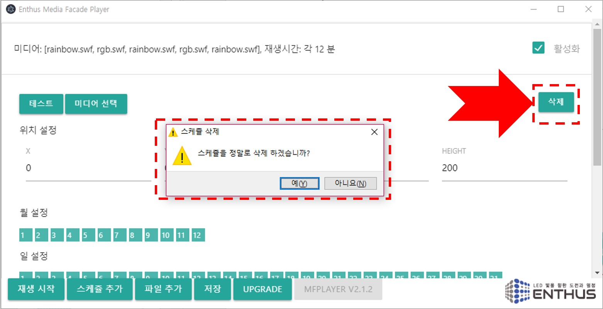
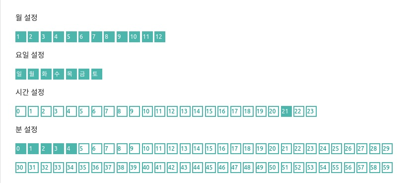

### 스케쥴 추가
하단 메뉴의 **스케쥴 추가** 버튼을 누르면, 모든 시간에 활성화되어 있는 기본 설정으로 새로운 스케쥴이 추가됩니다.

### 편집
스케쥴을 클릭하면 스케쥴 편집창이 열립니다.

테스트, 미디어 선택, 삭제, 위치 설정 및 시간 설정에 대한 메뉴가 나타납니다.

### 미디어 선택
미디어 제목을 클릭하면 미디어 선택 창이 나타납니다.

창의 상단에는 이전에 설정된 값이, 아래에는 선택가능한 파일 리스트가 표시됩니다.

!!! note
    새로 추가된 스케쥴일 경우 기본으로 rainbow.swf 가 선택되어 있습니다.

##### Group Play
MFPlayer 에는 여러개의 미디어 파일을 같은 설정으로 재생할 수 있는 Group Play 기능이 있습니다. 원하는 미디어 파일을 선택하면 차례대로 상단의 선택 리스트에 미디어 파일명이 표시됩니다.

오른쪽 상단 완료버튼을 눌러 선택을 종료합니다.

스케쥴 제목에 선택된 파일 리스트가 표시되고, 각 미디어의 재생 시간이 표시됩니다. 재생 시간은 전체 활성화된 분 시간의 개수를 미디어의 개수로 나눈 값으로 설정됩니다.

!!! Example
    - 60 분 활성화 / 2 개의 미디어 파일 선택 = 재생 시간: 30 분
    - 30 분 활성화 / 2 개의 미디어 파일 선택 = 재생 시간: 15 분
    - 30 분 활성화 / 5 개의 미디어 파일 선택 = 재생 시간: 6 분
    - 30 분 활성화 / 7 개의 미디어 파일 선택 = 재생 시간: 4 분 (7 번째 파일은 6 분 재생)
    - 10 분 활성화 / 11 개의 미디어 파일 선택 = 재생 시간: 1 분 (11 번째 파일 재생 안됨)

선택을 취소하려면 상단 오른쪽의 지우기 버튼을 눌러 차례로 삭제합니다.

### 위치 설정
미디어가 재생될 위치와 가로 세로 크기 정보를 입력합니다.

### 테스트
선택된 미디어와 위치 설정이 올바르게 되었는지 확인하려면 테스트 버튼을 누릅니다. 아래 메인 메뉴의 정지 버튼을 통해 테스트를 멈출 수 있습니다.

### 삭제
삭제 버튼을 클릭하면 경고메시지와 함께 스케쥴이 삭제됩니다.

### 활성화
스케쥴을 지우지 않고 사용하지 않는 상태로 유지하려면 활성화 박스를 클릭해서 상태를 바꿉니다. 활성화 되지 않은 스케쥴은 정해진 시간에 재생되지 않습니다.

### 시간 설정

!!! note
    MFPlayer 는 반복 재생을 위한 시간을 설정합니다. 시간 설정 버튼이 선택되어 있는 시간에만 반복적인 재생을 합니다.

스케쥴 편집창을 스크롤해 내리면 월, 요일, 일, 시간, 분 설정 버튼을 선택할 수 있습니다.

매년 1월 일요일에만 저녁 6시에서 8시사이에 30동안만 미디어가 재생할 경우 아래의 그림과 같이 설정합니다.

일년동안 저녁 6시에서 밤 12시까지 재생하는 예시는 아래와 같습니다.

일년동안 저녁 9시에 5 분동안 재생하는 예시는 아래와 같습니다.

### 재생
