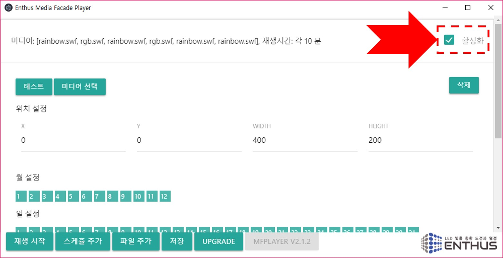

### 테스트
선택된 미디어와 위치 설정이 올바르게 되었는지 확인하려면 테스트 버튼을 누릅니다. 아래 메인 메뉴의 정지 버튼을 통해 테스트를 멈출 수 있습니다.

### 삭제
삭제 버튼을 클릭하면 경고메시지와 함께 스케쥴이 삭제됩니다.

### 활성화
스케쥴을 지우지 않고 사용하지 않는 상태로 유지하려면 활성화 박스를 클릭해서 상태를 바꿉니다. 활성화 되지 않은 스케쥴은 정해진 시간에 재생되지 않습니다.

### 시간 설정

!!! note
    MFPlayer 는 반복 재생을 위한 시간을 설정합니다. 시간 설정 버튼이 선택되어 있는 시간에만 반복적인 재생을 합니다.

스케쥴 편집창을 스크롤해 내리면 월, 요일, 일, 시간, 분 설정 버튼을 선택할 수 있습니다.

매년 1월 일요일에만 저녁 6시에서 8시사이에 30동안만 미디어가 재생할 경우 아래의 그림과 같이 설정합니다.

일년동안 저녁 6시에서 밤 12시까지 재생하는 예시는 아래와 같습니다.

일년동안 저녁 9시에 5 분동안 재생하는 예시는 아래와 같습니다.

### 재생
스케쥴 설정이 완료되면 **재생 시작** 버튼을 눌러 스케쥴 동작을 시작합니다. 스케쥴에 있는 시간 설정에 따라 정해진 시간에 미디어가 재생됩니다. 다시 **정지** 버튼을 눌러 스케쥴 동작을 멈출 수 있습니다.

