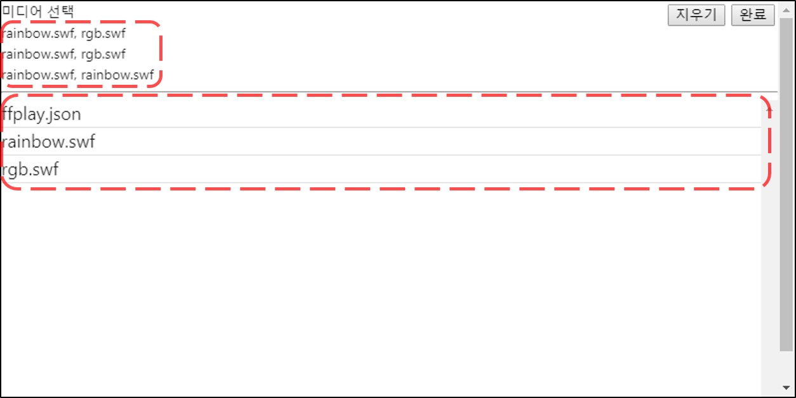

**미디어 선택**

재생할 파일을 선택하기 위해 `미디어 선택` 버튼을 클릭합니다.

창의 상단에는 이전에 설정된 값이, 아래에는 선택가능한 파일 리스트가 표시됩니다.

!!! note
    새로 추가된 스케쥴일 경우 기본으로 rainbow.swf 가 선택되어 있습니다.

**Group Play**

MFPlayer 에는 여러개의 미디어 파일을 같은 설정으로 재생할 수 있는 Group Play 기능이 있습니다. 원하는 미디어 파일을 선택하면 차례대로 상단의 선택 리스트에 미디어 파일명이 표시됩니다.

오른쪽 상단 완료버튼을 눌러 선택을 종료합니다.

스케쥴 제목에 선택된 파일 리스트가 표시되고, 각 미디어의 재생 시간이 표시됩니다. 재생 시간은 전체 활성화된 분 시간의 개수를 미디어의 개수로 나눈 값으로 설정됩니다.

!!! Example
- Group Play 설정 예시
    - 60 분 활성화 / 1 개의 미디어 파일 선택 = 재생 시간: 60 분
    - 60 분 활성화 / 2 개의 미디어 파일 선택 = 재생 시간: 30 분
    - 30 분 활성화 / 2 개의 미디어 파일 선택 = 재생 시간: 15 분
    - 30 분 활성화 / 5 개의 미디어 파일 선택 = 재생 시간: 6 분
    - 30 분 활성화 / 7 개의 미디어 파일 선택 = 재생 시간: 4 분 (7 번째 파일은 6 분 재생)
    - 10 분 활성화 / 11 개의 미디어 파일 선택 = 재생 시간: 1 분 (11 번째 파일 재생 안됨)

선택을 취소하려면 다시 `미디어 선택` 버튼을 누르고 상단 오른쪽의 `지우기` 버튼을 눌러 차례로 삭제합니다.

