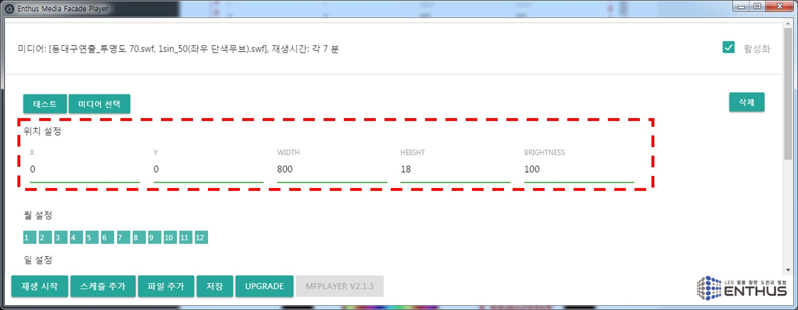

미디어가 재생될 위치와 가로 세로 크기 정보를 입력합니다.

X / Y 는 미디어 재생 화면의 가로 세로 위치를, Height / Width 는 재생화면의 가로 세로 크기를 각각 설정합니다. Brightness 값을 조정하면 연출 미디어의 밝기를 변경됩니다. Brightness 는 0 ~ 100 % 밝기로 조절됩니다.

!!! warning
    화면 위치와 크기는 [엔토스](www.etslight.co.kr) 에서 제공된 설정을 항상 유지해야 합니다. 새로운 스케쥴을 추가할 때에는 이전에 설정된 스케쥴 데이터를 참조하시기 바랍니다.