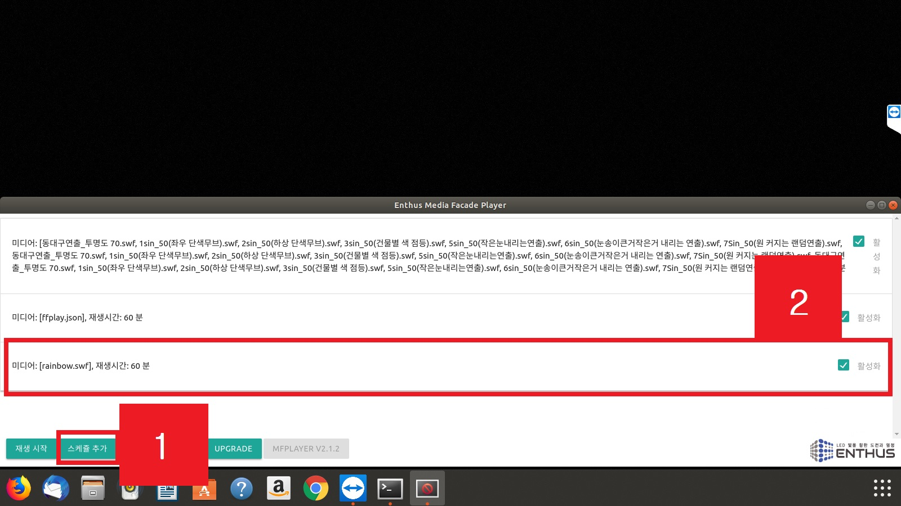
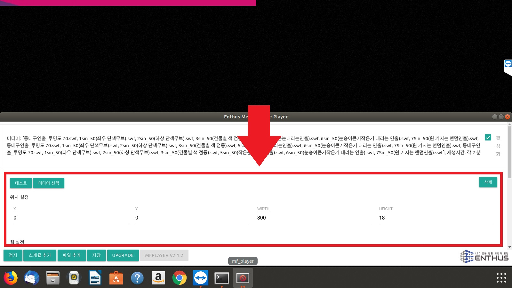

### 추가
하단 메뉴의 **스케쥴 추가** 버튼을 누르면, 모든 시간에 활성화되어 있는 기본 설정으로 새로운 스케쥴이 추가됩니다.

### 편집
스케쥴을 클릭하면 스케쥴 편집창이 열립니다. 편집창에서는 [테스트](/start_stop_test), [미디어 선택](/media_select), [삭제](/delete_enable), [위치 설정](/position) 및 [시간 설정](/time)이 가능합니다.

