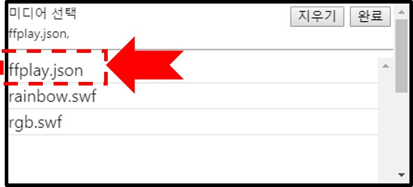

MFPlayer 에는 연출 동기화 기능이 있습니다. 재생 서버 MFPlayer 에 여러 개의 클라이언트 MFPlayer 가 연결되어 동시에 같은 미디어 파일을 재생합니다.

!!! warning
    연출 동기화 설정은 반드시 전문 엔토스 설치 엔지니어를 통해 진행하시기 바랍니다.

**서버 설정**

스케쥴을 추가하고 미디어를 ffplay.json 으로 선택합니다.

**클라이언트 설정**

서버에서 ffplay 스케쥴이 설정되어 있을 경우 저장, UPGRADE 버튼을 눌렀을때 자동으로 클라이언트도 동일하게 설정할지 물어보는 팝업이 나타납니다. 확인 버튼을 누르면 클라이언트 MFPlayer 에 동일한 설정이 전달됩니다.

!!! note
    클라이언트 MFPlayer 를 서버와 동일하게 설정하면 네트워크 연결에 문제가 발생했을때 자동으로 클라이언트 MFPlayer 저장되어 있는 동일한 미디어 파일을 재생합니다.

