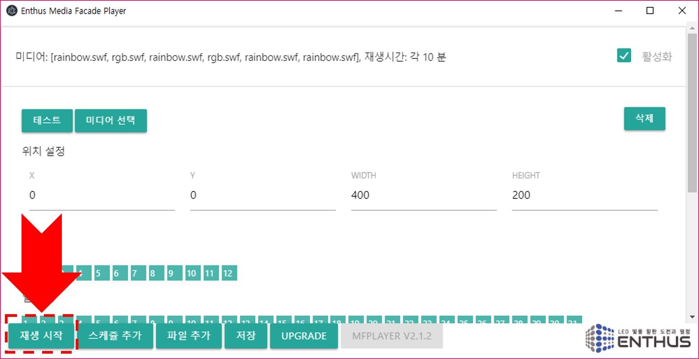
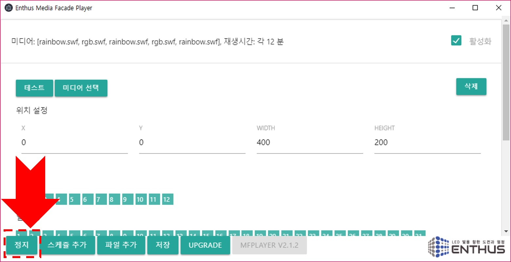
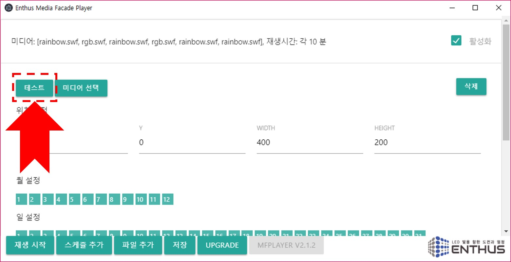

### 재생
스케쥴 설정이 완료되면 `재생 시작` 버튼을 눌러 스케쥴 동작을 시작합니다. 설정된 스케쥴의 시간에 따라 정해진 미디어가 재생됩니다.

### 정지
스케쥴 재생 중 `정지` 버튼을 누르면 스케쥴 동작을 멈추게 됩니다.

!!! warning
    스케쥴 변경 완료, 원격 접속이 완료된 뒤에는 반드시 `재생 시작` 버튼을 눌러 MFPlayer 가 동작 상태가 되도록 해야 합니다.

### 테스트
선택된 미디어와 위치 설정이 올바르게 되었는지 확인하려면 `테스트` 버튼을 누릅니다. 아래 메인 메뉴의 `정지` 버튼을 통해 테스트를 멈출 수 있습니다.

