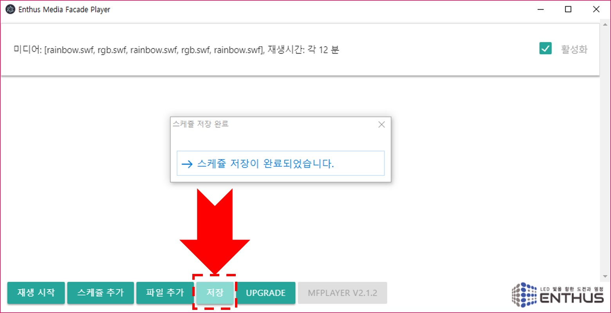
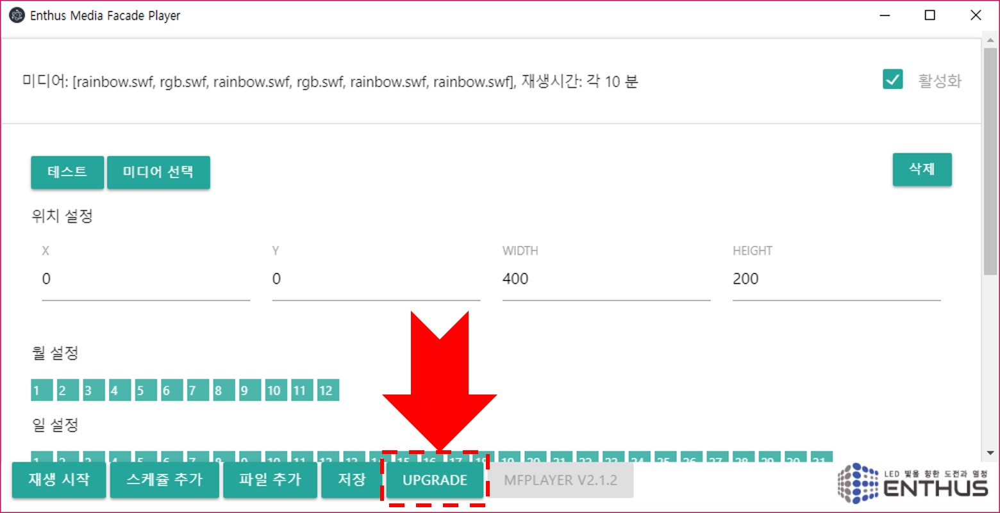

### 저장
하단 메인 메뉴의 `저장` 버튼을 누르면 수정한 스케쥴 설정이 저장됩니다. MFPlayer 가 정전으로 재부팅될 경우 저장된 스케쥴 데이터를 다시 읽어 그대로 재생할 수 있습니다.

!!! note
    MFPlayer 에서 `저장` 버튼을 누르지 않더라도 스케쥴 편집 후 1 번이라도 `재생` 버튼으로 재생을 하면 스케쥴 데이터는 안전하게 저장됩니다.

### UPGRADE
하단 메인 메뉴의 `UPGRADE` 버튼을 누르면 MFPlayer 가 최신 버젼 소프트웨어로 업그레이드 됩니다.

!!! warning
    안정버젼으로 업그레이드하기 위해서는 반드시 실행전 [엔토스](http://www.etslight.co.kr)에 문의하시기 바랍니다.

