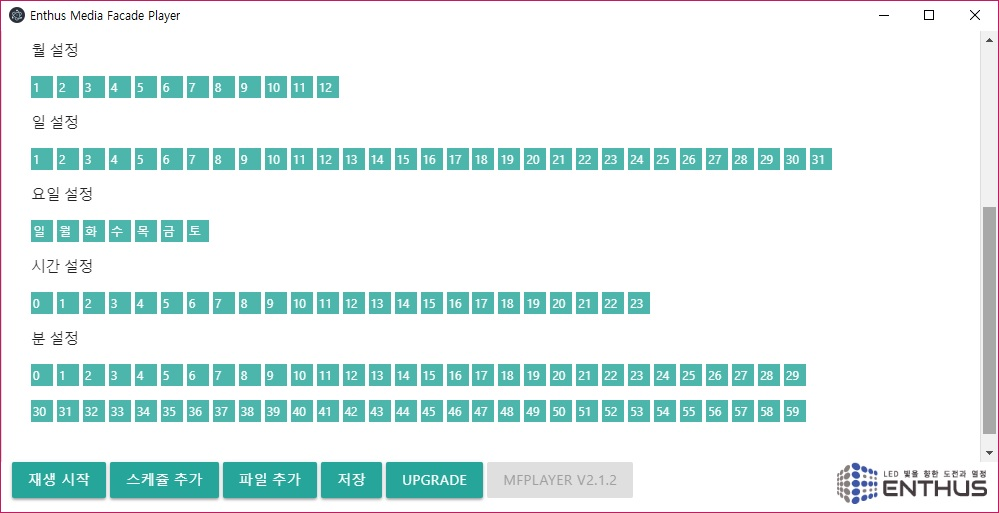
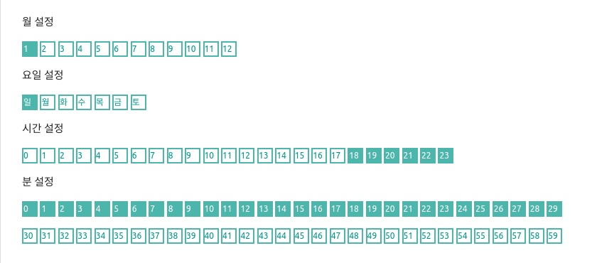
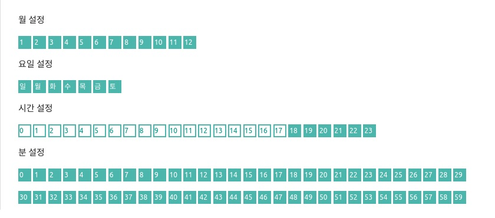
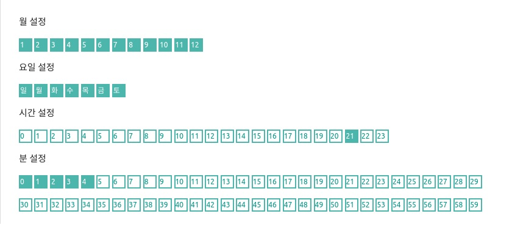

!!! note
    MFPlayer 는 반복 재생을 위한 시간을 설정합니다. 시간 설정 버튼이 선택되어 있는 시간에만 반복적인 재생을 합니다.

스케쥴 편집창을 스크롤해 내리면 월, 요일, 일, 시간, 분 설정 버튼을 선택할 수 있습니다.

빈 박스는 비활성화된 시간을, 색으로 채워진 박스는 활성화된 시간을 각각 의미합니다. 비활성화된 시간에 미디어 재생은 정지되고 활성화된 시간에는 미디어가 재생됩니다. 

!!! example

- 매년 1월 일요일에만 저녁 6시에서 8시사이에 30동안만 미디어가 재생할 경우 아래의 그림과 같이 설정합니다.

- 일년동안 저녁 6시에서 밤 12시까지 재생하는 예시는 아래와 같습니다.

- 일년동안 저녁 9시에 5 분동안 재생하는 예시는 아래와 같습니다.

